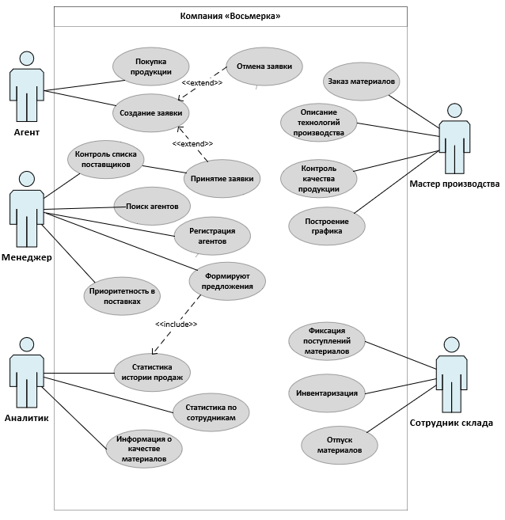

# ms

## ProductType:
```ms
USE [knemetzhanova]
GO

INSERT INTO [dbo].[ProductType]
           ([Title])

SELECT DISTINCT [Тип продукции]
  FROM [dbo].[Лист1$products_k_import]
   
```

## MaterialType:
```ms
USE [knemetzhanova]
GO

INSERT INTO [dbo].[MaterialType]
           ([Title])

		   
SELECT DISTINCT [Тип материала]
  FROM [dbo].[Лист1$materials_short_k_import]
   
```

## Material:
```ms
USE [knemetzhanova]
GO

INSERT INTO [dbo].[Material]
           ([Title]
           ,[CountInPack]
           ,[Unit]
           ,[CountInStock]
           ,[MinCount]
           ,[Cost]
           ,[MaterialTypeID])

SELECT [Наименованиематериала]
      ,[Количествовупаковке]
      ,[Единицаизмерения]
      ,[Количествонаскладе]
      ,[Минимальныйвозможныйостаток]
      ,[Стоимость]
	,MT.ID
  FROM [dbo].[Лист1$materials_short_k_import] mi, [MaterialType] mt

  WHERE mi.[ Тип материала]=mt.Title
   
```

## Product:
```ms
USE [knemetzhanova]
GO

INSERT INTO [dbo].[Product]
           ([Title]
           ,[ProductTypeID]
           ,[ArticleNumber]
           ,[Image]
           ,[ProductionPersonCount]
           ,[ProductionWorkshopNumber]
           ,[MinCostForAgent])

SELECT [Наименование продукции]
	  ,pt.ID
      ,[Артикул]
      ,[Изображение]
      ,[Количество человек для производства]
      ,[Номер цеха для производства]
      ,[Минимальная стоимость для агента]

  FROM [dbo].[Лист1$products_k_import] pi, [ProductType] pt

  WHERE pt.Title=pi.[Тип продукции]
   
```

## ProductMaterial:
```ms
USE [knemetzhanova]
GO

INSERT INTO [dbo].[ProductMaterial]
           ([ProductID]
           ,[MaterialID]
           ,[Count])

SELECT pt.ID
      ml.ID
      ,[Необходимое количество материала]
  FROM [dbo].[Лист1$] lt , [Product] pt , [Material] ml

  WHERE pt.Title=lt.Продукция AND ml.Title=lt.[Наименование материала]
   
```
## Спецификация варианта использования
```ms
1.
Имя ВИ: Создание заявки
Актеры: Агент,Менеджер
Краткое описание: Процесс формирования и обработки заявки агентом.
Предусловия: Если агент ранее уже производил закупку готовой продукции и предоставил данные о ее реализации, то на основании этих данных и текущих объемах готовой продукции менеджер формирует
предложение для агента. Если работа ведется с новым агентом, то менеджер сразу
предоставляет каталог готовой продукции и принимает заявку.
Основной поток: Агент создает заявку
Альтернативный поток: Агент может отменить заявку до момента внесения предоплаты.
Постусловия: Принятие заявки менеджером.

2.
Имя ВИ: Статистика истории продаж
Актеры: Аналитик,Менеджер
Краткое описание:  Менеджеры принимают от агентов заявки на продукцию,а также формируют для них предложении на основании статистики.
Предусловия: Производство и продажа продукции
Основной поток: Аналитик составляет статистику историй продаж
Альтернативный поток: Нет
Постусловия: Формирование предложений для агентов.

3.
Имя ВИ: Заказ материалов
Актеры: Мастер производства 
Краткое описание: Заказом материалов у поставщиков для производства продукции
занимается мастер производства.
Предусловия: Для производства конкретной продукции используется несколько типов исходных материалов
(сырья), поэтому нам очень важно постоянно иметь актуальную информацию об остатках на
складах. Необходимо сохранять следующую информацию о материалах: наименование, тип
материала, возможные поставщики, количество в упаковке, единица измерения, количество на
складе, минимальное допустимое количество, описание, изображение материала и его
стоимость.
Основной поток: Мастер производства делает заказ материалов
Альтернативный поток: Нет
Постусловия: Производство продукции.
```

### UseCase
 